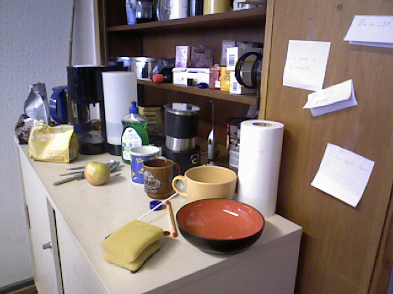
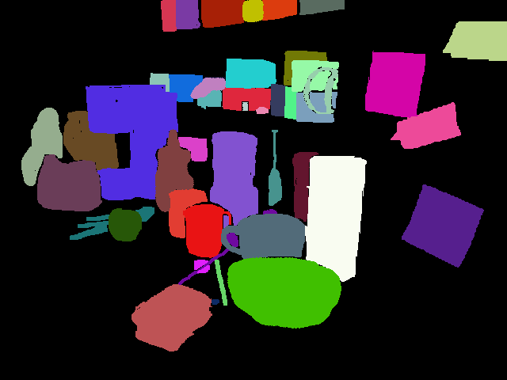

## Homepage of German Martin Garcia

This is my personal website. You can find here a summary of my work and publications.

### Short Bio

1-09-2017 - Present:
Postdoc in Autonomous Intelligent Systems - University of Bonn

15-02-2012 - 27-07-2015

PhD Student in Intelligent Vision Systems - University of Bonn

1-09-2009 - 15-02-2012: MSc in Computer Science - University of Bonn

### Recent publications

_Robolink Feeder: Reconfigurable Bin-Picking and Feeding with a Lightweight Cable-Driven Manipulator_
Seongyong Koo, Grzegorz Ficht, Germán Martín García, Dmytro Pavlichenko, Martin Raak and Sven Behnke	
Accepted for the 13th IEEE International Conference on Automation Science and Engineering (CASE), Xi'an, China, to appear August 2017.
[PDF](http://ais.uni-bonn.de/papers/CASE_2017_Koo.pdf)
[Video](http://ais.uni-bonn.de/videos/CASE_2017_Koo.mp4)

_A Computational Framework for RGB-D Attentional Object Discovery_
Germán Martín García, Mircea Pavel and Simone Frintrop
Cognitive Processing 2017

Full list of publications at [google scholar](https://scholar.google.de/citations?user=QFBQjH0AAAAJ&hl=en)

## Projects 

This is a list of projects I have been involved in the past years

### Amazon Robotics Challenge

<iframe src="https://www.youtube.com/embed/1QqQLq5hsN4?rel=0" width="640" height="480" frameborder="0" webkitallowfullscreen mozallowfullscreen allowfullscreen> </iframe>

As part of the <a href="https://www.ais.uni-bonn.de/nimbro/Picking/index.html">Team NimbRo Picking</a> we ended second in the final round and second in the pick task of the <a href="https://www.amazonrobotics.com/#/roboticschallenge">Amazon Robotics Challenge</a> 

### STAMINA
<iframe src="https://www.youtube.com/embed/OInHDueqnQ8?rel=0" width="640" height="480" frameborder="0" webkitallowfullscreen mozallowfullscreen allowfullscreen> </iframe>

Sustainable and Reliable Robotics for Part Handling in Manufacturing Automation. This european project dealt with the intralogistics of automotive parts. At the University of Bonn we dealt with the perception and picking of parts. More information at the <a href="http://stamina-robot.eu/">project website</a> 

### Object Discovery

{:height="96px" width="128px"} {:height="96px" width="128px"} 
During my PhD I worked on the topic of object proposal generation/object discovery. I drew inspiration from the cognitive sciences and applied it to build computer vision systems. My PhD thesis is available [online](http://hss.ulb.uni-bonn.de/2016/4426/4426.htm)

### RGB-D Object Tracking
This is the work I did as a Master Student at the IVS group on RGB-D tracking:
[RGB-D Tracking](tracking.md)
