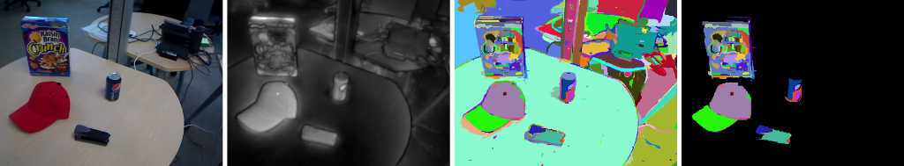

## Homepage of Germán Martín García

This is my personal website. You can find here a summary of my work and publications.

### Short Bio

| ------------- |:-------------:| -----:|
|September-2015 - August-2017 | Research Assistant | Autonomous Intelligent Systems - University of Bonn|
|February-2012 - July-2015| Research Assistant (Ph.D. Student) | Intelligent Vision Systems - University of Bonn|
|August-2011 - January-2012| Student Assistant | Intelligent Vision Systems - University of Bonn|
|September-2009 - February-2012|MSc in Computer Science |University of Bonn|
|September 2008 - August 2009|Software Engineer at Deimos-Space| Madrid, Spain|
|September 2002 - July 2002| BSc. Computer Science | Universidad Autónoma de Madrid, Spain|

### Recent publications

_Robolink Feeder: Reconfigurable Bin-Picking and Feeding with a Lightweight Cable-Driven Manipulator_  
Seongyong Koo, Grzegorz Ficht, Germán Martín García, Dmytro Pavlichenko, Martin Raak and Sven Behnke	 
Accepted for the 13th IEEE International Conference on Automation Science and Engineering (CASE), Xi'an, China, to appear August 2017.
[PDF](http://ais.uni-bonn.de/papers/CASE_2017_Koo.pdf)
[Video](http://ais.uni-bonn.de/videos/CASE_2017_Koo.mp4)

_A Computational Framework for RGB-D Attentional Object Discovery_ 
Germán Martín García, Mircea Pavel and Simone Frintrop 
Cognitive Processing 2017

Full list of publications at [google scholar](https://scholar.google.de/citations?user=QFBQjH0AAAAJ&hl=en)

## Projects 

This is a list of projects I have been involved in the past years

### STAMINA
<iframe src="https://www.youtube.com/embed/OInHDueqnQ8?rel=0" width="640" height="480" frameborder="0" webkitallowfullscreen mozallowfullscreen allowfullscreen> </iframe>

Sustainable and Reliable Robotics for Part Handling in Manufacturing Automation. This european project dealt with the intralogistics of automotive parts. At the University of Bonn we dealt with the perception and picking of parts. More information at the <a href="http://www.ais.uni-bonn.de/STAMINA/">project website</a> 

### EUROC2
<iframe src="https://www.youtube.com/embed/Q-U5UZBWUOU?rel=0" width="640" height="480" frameborder="0" webkitallowfullscreen mozallowfullscreen allowfullscreen> </iframe>
A smaller scale version of the STAMINA project on a Kuka mobile platform.

### Amazon Robotics Challenge

<iframe src="https://www.youtube.com/embed/1QqQLq5hsN4?rel=0" width="640" height="480" frameborder="0" webkitallowfullscreen mozallowfullscreen allowfullscreen> </iframe>

As part of the <a href="https://www.ais.uni-bonn.de/nimbro/Picking/index.html">Team NimbRo Picking</a> we ended second in the final round and second in the pick task of the <a href="https://www.amazonrobotics.com/#/roboticschallenge">Amazon Robotics Challenge</a> 

### Object Discovery

During my PhD I worked on the topic of object proposal generation/object discovery. I drew inspiration from cognitive sciences and applied it to build a computer vision system to generate object candidates on images. My PhD thesis is available [online](http://hss.ulb.uni-bonn.de/2016/4426/4426.htm)

Some relevant publications are:

_Saliency-based Object Discovery on RGB-D Data with a Late-Fusion Approach_ 
Germán Martín García, Ekaterina Potapova, Thomas Werner, Michael Zillich, Markus Vincze, and Simone Frintrop  IEEE International Conference on Robotics and Automation (ICRA 2015), Seattle, May 2015 [PDF](http://pages.iai.uni-bonn.de/frintrop_simone/paper/gmg-etal-ICRA2015.pdf)

_Sequence-Level Object Candidates Based on Saliency for Generic Object Recognition on Mobile Systems_  
Esther Horbert, Germán Martín García, Simone Frintrop, and Bastian Leibe.  IEEE International Conference on Robotics and Automation (ICRA 2015), Seattle, May 2015  [PDF](http://pages.iai.uni-bonn.de/frintrop_simone/paper/horbert-etal-ICRA2015.pdf) 
_Best vision paper award finalist_

### [RGB-D Object Tracking](tracking.md)
This is the work I did as a Master Student at the IVS group on RGB-D tracking. More information can be found here [RGB-D Tracking](tracking.md)

<iframe src="https://player.vimeo.com/video/33781357" width="640" height="480" frameborder="0" webkitallowfullscreen mozallowfullscreen allowfullscreen> </iframe>

