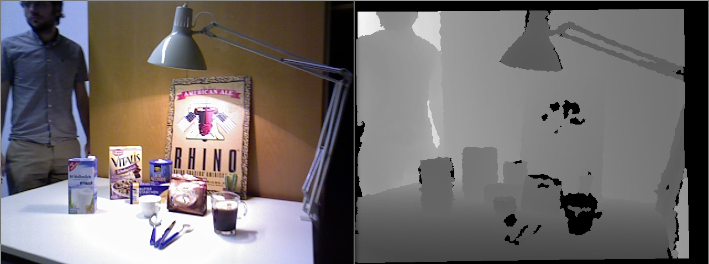
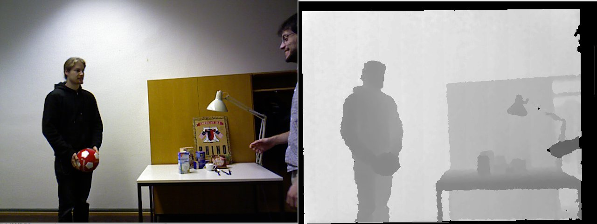
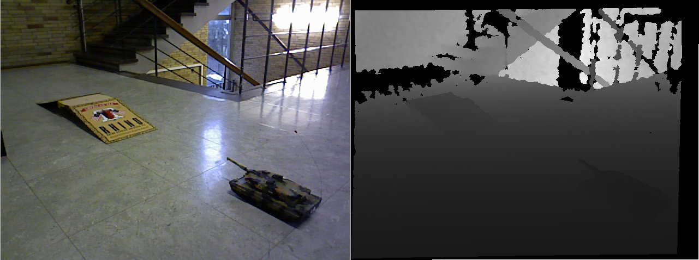
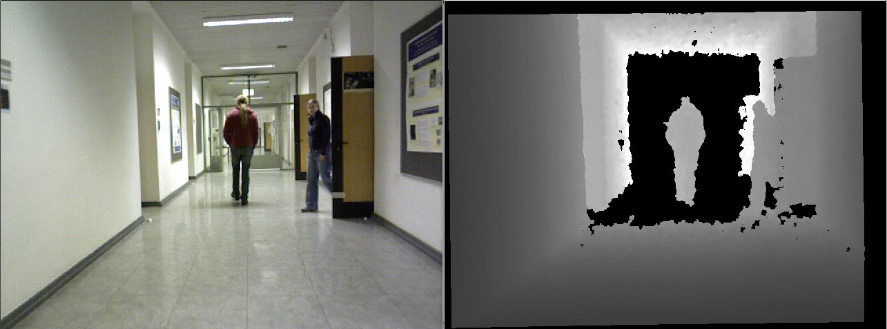
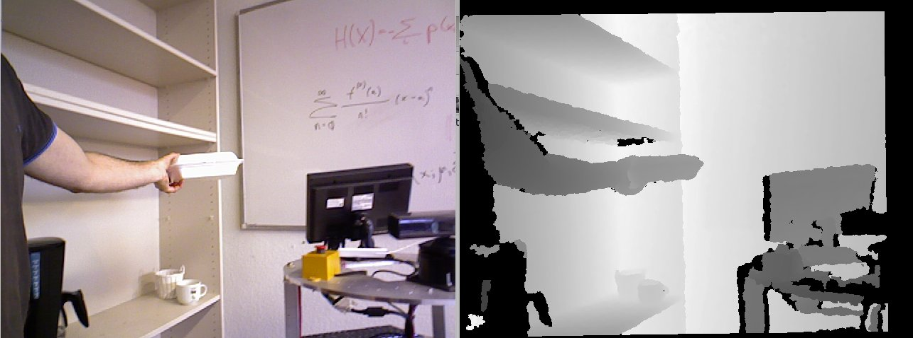

# Adaptive Multi-Cue 3D Tracking of Arbitrary Objects

<iframe src="https://player.vimeo.com/video/33781357" width="640" height="480" frameborder="0" webkitallowfullscreen mozallowfullscreen allowfullscreen> </iframe>

<a href="https://vimeo.com/33781357">Adaptive Object Tracking. RC Leopard Sequence</a> from <a href="https://vimeo.com/germanmg">German Martin</a> on <a href="https://vimeo.com">Vimeo</a>.

## BoBoT-D Benchmark

It is an extension of the BoBoT benchmark that contains 5 sequences with RGB-D data. 

 All the data of this benchmark is released under a CC BY-NC 3.0 license, please read the terms of use at http://creativecommons.org/licenses/by-nc/3.0/
If you publish work based on this benchmark, please cite the following paper:

*Adaptive Multi-Cue 3D Tracking of Arbitrary Objects*
Germán Martín García, Dominik A. Klein, Jörg Stückler, Simone Frintrop, and Armin B. Cremers 
DAGM/OAGM Conference, August 28-31, 2012, Graz, Austria 

| [Sequence M (Milk)](https://drive.google.com/uc?id=0BzA882ZfDaNmX1BReXN4WU1POU0&export=download)  |  |
| [Sequence N (Ball)](https://drive.google.com/uc?id=0BzA882ZfDaNmNGd3UFVWN3dTb28&export=download)  |  |
| [Sequence O (Tank)](https://drive.google.com/uc?id=0BzA882ZfDaNmNFFubnBzRHNOOXM&export=download)  |  |
| [Sequence P (Person)](https://drive.google.com/uc?id=0BzA882ZfDaNmU2FsZVJhNmZ3UWs&export=download)  |  |
| [Sequence Q (Lunchbox)](https://drive.google.com/uc?id=0BzA882ZfDaNmTFRxVm9GdUkzbzg&export=download)  |  |
| [Ground truth files](gt.zip) | [Evaluation tool](evaluator.zip) |

### Results

<table cellpadding="0" cellspacing="0" >
			<thead>
				<tr>
					<th></th>
					<th class="center" colspan="2" >Milk</th>
					<th class="center" colspan="2" >Ball</th>
					<th class="center" colspan="2" >Tank</th>
					<th class="center" colspan="2" >Person</th>
					<th class="center" colspan="2" >Box</th>
					<th class="center" colspan="3">Averages</th>
				</tr>
				<tr style="width: 50%">
					<th></th>
					<th>Overlap</th>
					<th>Hit</th>
					<th>Overlap</th>
					<th>Hit</th>
					<th>Overlap</th>
					<th>Hit</th>
					<th>Overlap</th>
					<th>Hit</th>
					<th>Overlap</th>
					<th>Hit</th>
					<th>CPU</th>
					<th>Overlap</th>
					<th>Hit</th>
				</tr>
			</thead>
				<tbody>
					<tr>
						<td>Adaptive 3D Tracking<a href="#Adaptive"> [1]</a></td>
						<td>73.47</td>
						<td>96.77</td>
						<td>69.80</td>
						<td>96.91</td>
						<td>55.33</td>
						<td>94.09</td>
						<td>70.67</td>
						<td>95.32</td>
						<td>73.10</td>
						<td>99.81</td>
						<td>30.69</td>
						<td>68.47</td>
						<td>96.58</td>
					</tr>
					
					<tr>
						<td>DS-KCF<a href="#KCF"> [2]</a></td>
						<td>76.6</td>
						<td>100.0</td>
						<td>7.9</td>
						<td>10.3</td>
						<td>43.9</td>
						<td>72.5</td>
						<td>73.4</td>
						<td>98.0</td>
						<td>66.1</td>
						<td>100.0</td>
						<td>30</td>
						<td>53.6</td>
						<td>76.2</td>
					</tr>
					             
					
					<tr>
						<td>Person Tracking <a href="#Efficient">[3]</a></td>
						<td>-</td>
						<td>-</td>
						<td>-</td>
						<td>-</td>
						<td>-</td>
						<td>-</td>
						<td>80.09</td>
						<td>96.04</td>
						<td>-</td>
						<td>-</td>
						<td>-</td>
						<td>-</td>
						<td>-</td>
					</tr>

				</tbody>	
			</table>

If you have new results to report, please send me an [email](mailto:martin@iai.uni-bonn.de?Subject=BoBoT-D) and I will update the results!
__References:__
  \[1\] Germán Martín García, Dominik A. Klein, Jörg Stückler, Simone Frintrop, and Armin B. Cremers, Adaptive Multi-Cue 3D Tracking of Arbitrary Objects, DAGM-OAGM Conference, August 28-31, 2012, Graz, Austria
  \[2\] M. Camplani, S. Hannuna,  M. Mirmehdi, D. Damen, A. Paiement, L. Tao, T. Burghardt. Real-time RGB-D Tracking with Depth Scaling Kernelised Correlation Filters and Occlusion Handling. British Machine Vision Conference, September 2015.
			 [DS-KCF webpage](http://www.irc-sphere.ac.uk/work-package-2/DS-KCF)
			  \[3\] Hans Gaiser, B.S. (2012), Efficient Person Tracking based on Depth data. Bachelor Thesis, Technical University of Delft.
